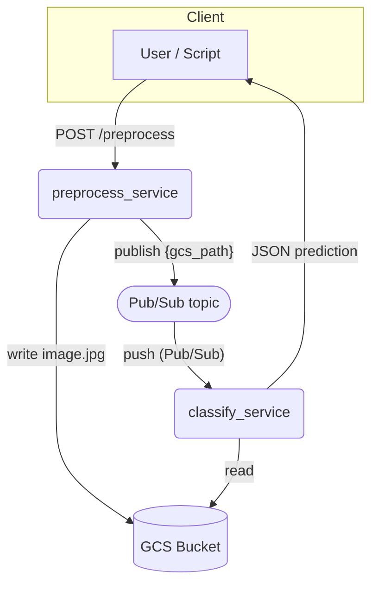

# Image Processing Services Demo

Proof‑of‑concept that links two micro‑services on **Google Cloud Run** to build an image‑processing pipeline:

1. **`preprocess_service`**
   • resizes and stores the uploaded image on Cloud Storage
   • publishes a message on Pub/Sub so that downstream stages can react.

2. **`classify_service`**
   • receives the Pub/Sub push, downloads the image from GCS
   • classifies it with **MobileNetV2**.

The classifier can also be invoked synchronously via the `/classify` endpoint.

---

## Architecture



---

## Quick start

### Prerequisites

* Google Cloud project with **Cloud Run** and **Pub/Sub** enabled
  `gcloud services enable run.googleapis.com pubsub.googleapis.com`
* Artifact Registry repository (e.g. `img-demo`)
* Docker and Git
* `gcloud` CLI configured → `gcloud auth login`

### Deploy with GitHub Actions

Pushing to the **`main`** branch triggers the workflow:

```bash
git push origin main
```

The workflow will:

1. Build and push both images to Artifact Registry.
2. Deploy `preprocess-service` and `classify-service` on Cloud Run.
3. Create the Pub/Sub topic **`img-preprocessed`** and a push subscription
   that targets the classifier.

---

## Local development

```bash
# --- preprocess_service ---
cd preprocess_service
export BUCKET=my-test-bucket
export PREP_TOPIC=img-preprocessed   # optional
docker compose up --build

# --- classify_service ---
cd ../classify_service
docker compose up --build
```

* `preprocess_service` exposes **[http://localhost:8000/preprocess](http://localhost:8000/preprocess)**
* `classify_service`   exposes **[http://localhost:8001/classify](http://localhost:8001/classify)**

---

## Endpoints

| Service             | Method & Path      | Body                                        | Response                                              |
| ------------------- | ------------------ | ------------------------------------------- | ----------------------------------------------------- |
| preprocess\_service | `POST /preprocess` | multipart form field **`file`**             | `{ "gcs_path": "gs://…/image.jpg" }`                  |
| classify\_service   | `POST /classify`   | `{ "gcs_path": "gs://…/image.jpg" }`        | `{ "label": "golden retriever", "confidence": 0.93 }` |
| classify\_service   | `POST /pubsub`     | (called by Pub/Sub, JSON envelope – base64) | `{ "status": "ok", "label": … }`                      |

---

## Testing the cloud deployment

```bash
TOKEN=$(gcloud auth print-identity-token)

curl -H "Authorization: Bearer $TOKEN" \
     -F "file=@sample.jpg" \
     "https://PREPROCESS_URL/preprocess"
# -> returns { "gcs_path": … }

# The classifier is triggered automatically via Pub/Sub.
# To follow the logs:
gcloud logs tail "resource.labels.service_name=classify-service" \
  --region=europe-west1 --project=YOUR_PROJECT
```

---

## Clean‑up

```bash
gcloud run services delete preprocess-service --region=europe-west1
gcloud run services delete classify-service  --region=europe-west1

gcloud artifacts docker images delete \
  "europe-west1-docker.pkg.dev/YOUR_PROJECT/img-demo/*" --quiet

gcloud pubsub topics delete img-preprocessed
```

---

## Extensions

* Replace MobileNetV2 with a custom TensorFlow or PyTorch model.
* Enable service‑to‑service authentication via IAM.
* Buffer predictions into BigQuery for analytics.

---

## License

GPL v3

> **Note:** Parts of the codebase and documentation were created with the support of generative AI tools (e.g., OpenAI ChatGPT + Codex). All content has been manually reviewed before publication.

---

© 2025 Mattia Mellone
