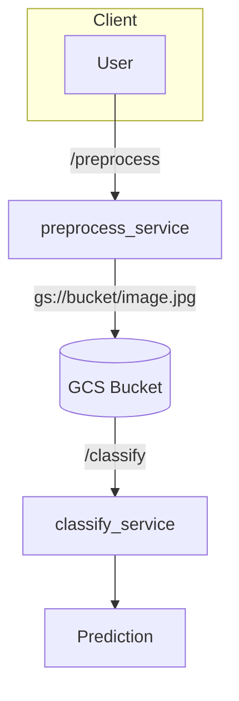

# Image Processing Services Demo

[](https://example.com)

Proof-of-concept demonstrating deployment of two image-processing micro-services
on Google Cloud Run. The pipeline performs image pre-processing followed by
classification with MobileNetV2.

## Architecture



## Quick start

### Prerequisites
- Google Cloud account with Cloud Run enabled
- Docker and GitHub Actions
- `gcloud` CLI authenticated (`gcloud auth login`)

### Build and deploy
Run the GitHub Actions workflow which builds the images and deploys them to Cloud Run:

```bash
# trigger from local git
git push origin main
```

The workflow builds Docker images and pushes them to Artifact Registry. It then
deploys both services to Cloud Run.

## Local development

```bash
# Preprocess service
cd preprocess_service
BUCKET=my-bucket docker compose up --build

# Classify service
cd ../classify_service
docker compose up --build
```
Set the `BUCKET` environment variable for the preprocess service. Both services
expose a FastAPI app on `localhost:8000` by default.

## Endpoints

### POST /preprocess
Send a multipart/form-data request containing an image file.
Response example:
```json
{ "gcs_path": "gs://my-bucket/image.jpg" }
```

### POST /classify
Send JSON with the path returned by the preprocess service.
Response example:
```json
{ "label": "Labrador retriever", "confidence": 0.93 }
```

## Cost control
- Cloud Run charges per request and compute time; keep traffic low during testing.
- Delete services and Artifact Registry images when finished:
```bash
gcloud run services delete preprocess-service
gcloud run services delete classify-service
```

## Extensions
- Add authentication between the services
- Experiment with different models or preprocessing steps

## License
MIT

## Author
Your Name Here
